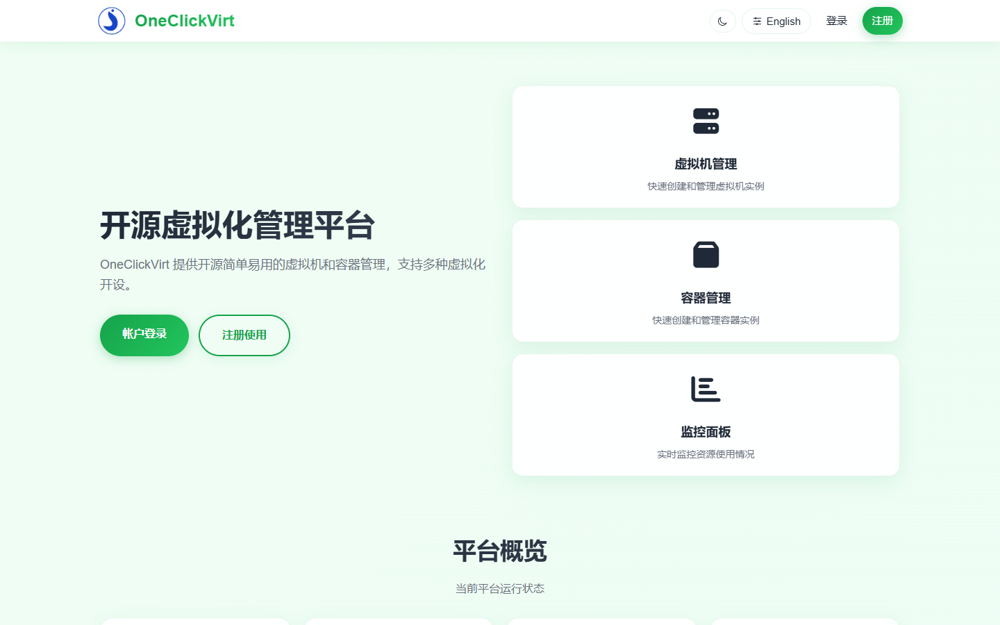
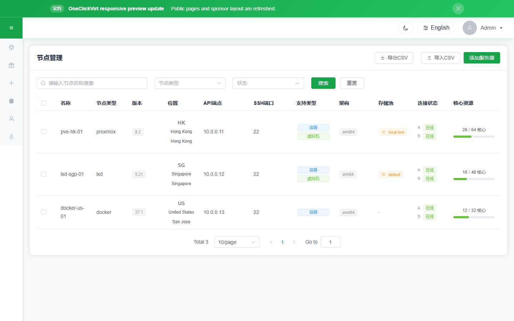
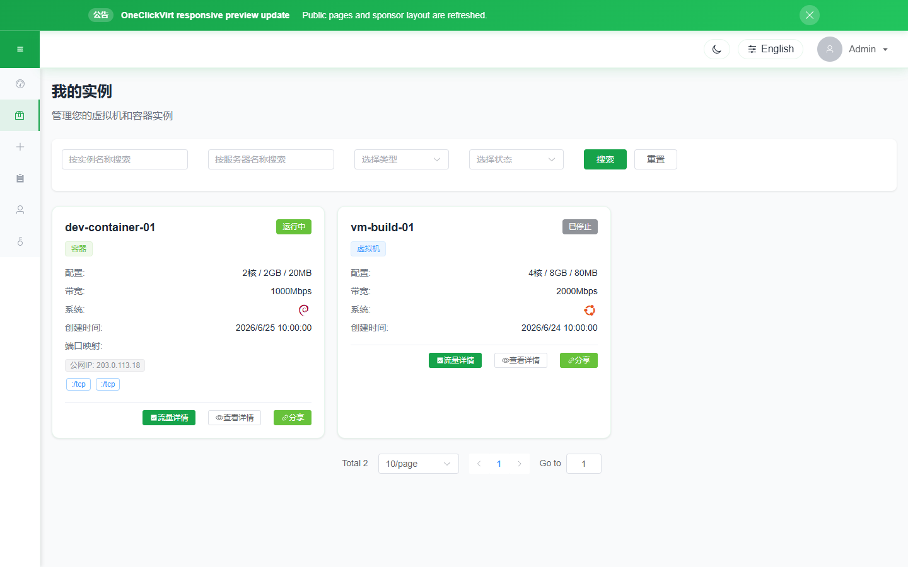

# OneClickVirt Virtualization Management Platform

[](https://github.com/oneclickvirt/oneclickvirt/actions/workflows/build.yml)

[](https://github.com/oneclickvirt/oneclickvirt/actions/workflows/build_docker.yml)

[](https://github.com/oneclickvirt/oneclickvirt/actions/workflows/integration-tests.yml)

[](https://app.fossa.com/projects/git%2Bgithub.com%2Foneclickvirt%2Foneclickvirt?ref=badge_shield&issueType=license) [](https://app.fossa.com/projects/git%2Bgithub.com%2Foneclickvirt%2Foneclickvirt?ref=badge_shield&issueType=security)

An extensible universal virtualization management platform that supports LXD, Incus, Docker, Podman, Containerd, Proxmox VE, QEMU/KVM, and KubeVirt.

The web console uses Vue 3, Vite, and Element Plus, with responsive layouts checked for desktop, tablet, Android-sized, and iOS-sized viewports.

## **Language**

[English Docs](README.md) | [中文文档](README_ZH.md)

## Detailed Description

[www.spiritlhl.net](https://www.spiritlhl.net/en/guide/oneclickvirt/oneclickvirt_precheck.html)

## Integration Test Report

The automated integration test report is available at: [oneclickvirt.github.io/oneclickvirt](https://oneclickvirt.github.io/oneclickvirt/)

The report supports bilingual display (Chinese/English), light/dark theme switching, Git ref/SHA/run metadata, and server log expansion for failed cases, covering 200+ API endpoint tests including functional, permission, boundary, and security tests. See [`action_tests/`](action_tests/) for details.

## Supported Virtualization Platforms

| Type ID | Platform | Instance Types | Repository |
|---------|----------|----------------|------------|
| `lxd` | LXD | container, vm | [oneclickvirt/lxd](https://github.com/oneclickvirt/lxd) |
| `incus` | Incus | container, vm | [oneclickvirt/incus](https://github.com/oneclickvirt/incus) |
| `docker` | Docker | container | [oneclickvirt/docker](https://github.com/oneclickvirt/docker) |
| `podman` | Podman | container | [oneclickvirt/podman](https://github.com/oneclickvirt/podman) |
| `containerd` | Containerd (nerdctl) | container | [oneclickvirt/containerd](https://github.com/oneclickvirt/containerd) |
| `proxmox` | Proxmox VE | container, vm | [oneclickvirt/pve](https://github.com/oneclickvirt/pve) |
| `qemu` | QEMU | vm | [oneclickvirt/qemu](https://github.com/oneclickvirt/qemu) |
| `kubevirt` | KubeVirt | vm | [oneclickvirt/kubevirt](https://github.com/oneclickvirt/kubevirt) |

Additional backend adapters are available for local or desktop virtualization experiments, including `orbstack`, `multipass`, `vagrant`, `virtualbox`, and `vmware`. See [`server/provider/README.md`](server/provider/README.md) for implementation details and support scope.

## Quick Deployment

Avoid compiling from source whenever possible. We recommend deploying using separate binary files or directly pulling the Docker image for deployment.

### Method 0: Using the 1Panel Third-Party App Store

[okxlin/appstore](https://github.com/okxlin/appstore) now includes OneClickVirt. If you already use 1Panel, follow that repository's instructions to add or synchronize the local app store, then deploy `oneclickvirt` from the local app list.

### Method 1: Using Pre-built Images

Use pre-built multi-architecture images that automatically downloads the appropriate version for your system architecture.

**Image Tags:**

| Image Tag | Description | Use Case |
|-----------|-------------|----------|
| `oneclickvirt/oneclickvirt:latest` | All-in-one version (built-in database) | Quick deployment |
| `oneclickvirt/oneclickvirt:20260717` | All-in-one version with specific date | Fixed version requirement |
| `oneclickvirt/oneclickvirt:no-db` | Standalone database version | Without database |
| `oneclickvirt/oneclickvirt:no-db-20260717` | Standalone database version with date | Without database |

All images support both `linux/amd64` and `linux/arm64` architectures.

<details>
<summary>View All-in-One Version (Built-in Database)</summary>

**Basic Usage (without domain configuration):**

```bash
docker run -d \
  --name oneclickvirt \
  -p 80:80 \
  -v oneclickvirt-data:/var/lib/mysql \
  -v oneclickvirt-storage:/app/storage \
  --restart unless-stopped \
  oneclickvirt/oneclickvirt:latest
```

**Configure Domain Access:**

If you need to configure a domain, set the `FRONTEND_URL` environment variable:

```bash
docker run -d \
  --name oneclickvirt \
  -p 80:80 \
  -e FRONTEND_URL="https://your-domain.com" \
  -v oneclickvirt-data:/var/lib/mysql \
  -v oneclickvirt-storage:/app/storage \
  --restart unless-stopped \
  oneclickvirt/oneclickvirt:latest
```

Or using GitHub Container Registry:

```bash
docker run -d \
  --name oneclickvirt \
  -p 80:80 \
  -e FRONTEND_URL="https://your-domain.com" \
  -v oneclickvirt-data:/var/lib/mysql \
  -v oneclickvirt-storage:/app/storage \
  --restart unless-stopped \
  ghcr.io/oneclickvirt/oneclickvirt:latest
```

</details>

<details>
<summary>View Standalone Database Version</summary>

Use external database for smaller image size and faster startup:

```bash
docker run -d \
  --name oneclickvirt \
  -p 80:80 \
  -e FRONTEND_URL="https://your-domain.com" \
  -e DB_HOST="your-mysql-host" \
  -e DB_PORT="3306" \
  -e DB_NAME="oneclickvirt" \
  -e DB_USER="root" \
  -e DB_PASSWORD="your-password" \
  -v oneclickvirt-storage:/app/storage \
  --restart unless-stopped \
  oneclickvirt/oneclickvirt:no-db
```

**Environment Variables:**
- `FRONTEND_URL`: Frontend access URL (required, supports http/https)
- `DB_HOST`: Database host address
- `DB_PORT`: Database port (default 3306)
- `DB_NAME`: Database name
- `DB_USER`: Database username
- `DB_PASSWORD`: Database password

The `no-db` image stores its runtime configuration at `/app/storage/config.yaml` in the `oneclickvirt-storage` volume. Reuse the same storage volume when updating the image or recreating the container; database settings entered on the initialization page and other system-level settings then survive replacement. Non-empty `DB_*` environment variables take precedence over the file, so recreations may also keep passing the same database environment. Deployments that explicitly mount `/app/config.yaml` continue to use that file first.

</details>

> **Note**: `FRONTEND_URL` is used to configure the frontend access address, affecting features like CORS and OAuth2 callbacks. The system will automatically detect HTTP/HTTPS protocol and adjust configurations accordingly. The protocol prefix can be either http or https.

### Method 2: Using Docker Compose

<details>
<summary>View Docker Compose Deployment</summary>

Use Docker Compose to deploy the complete development environment with one command, using **multi-container deployment** architecture with separate frontend, backend, and database containers:

```bash
git clone https://github.com/oneclickvirt/oneclickvirt.git
cd oneclickvirt
cat > .env << 'EOF'
MYSQL_ROOT_PASSWORD=change-this-root-password
MYSQL_PASSWORD=change-this-app-password
EOF
docker-compose up -d --build || docker compose up -d --build
```

**Default Configuration:**

- Frontend service: `http://localhost:8888`
- Backend API: Accessed via frontend proxy
- MariaDB database: Port 3306, database name `oneclickvirt`
- Database credentials: `MYSQL_ROOT_PASSWORD` and `MYSQL_PASSWORD` from `.env`
- Data persistence:
  - Database data: Docker volume `mysql_data`
  - Application storage: `./data/app/`

**Initialization Configuration:**

When accessing for the first time, you will enter the initialization interface. Please fill in the database configuration as follows:
- Database Host: `mysql` (container name, not 127.0.0.1)
- Database Port: `3306`
- Database Name: `oneclickvirt`
- Database User: `oneclickvirt`
- Database Password: Use the `MYSQL_PASSWORD` value from `.env`

**Custom Port (Optional):**

To modify the frontend access port, edit the ports configuration in `docker-compose.yaml`:

```yaml
services:
  web:
    ports:
      - "your-port:80"  # e.g., "80:80" or "8080:80"
```

**Stop Services:**

```bash
docker-compose down
```

**View Logs:**

```bash
docker-compose logs -f
```

**Clean Data:**

```bash
docker-compose down
rm -rf ./data
```

</details>

### Method 3: Bare-metal Full Installer

<details>
<summary>View Full Installer</summary>

`scripts/install_full.sh` installs the database, reverse proxy, TLS configuration, frontend, backend, and system service in one flow. It supports MySQL-compatible local databases (MySQL or MariaDB) and Caddy, Nginx, or OpenResty.

The installer auto-detects common Linux and Unix-like targets, including Debian/Ubuntu, RHEL/CentOS/Rocky/Alma/Fedora/Amazon Linux, openSUSE/SLES, Arch/Manjaro, Alpine, and BSD package managers. It also detects systemd, OpenRC, rc.d/service, and no-init environments. On distributions where native MySQL packages are unavailable or unstable, the installer automatically falls back to MariaDB as the MySQL-compatible backend; use `--no-db-fallback` to disable this behavior. BSD installs require a matching release asset for the OS/architecture, otherwise use Docker/Linux or build the server from source.

The domain input auto-detects protocol prefixes: enter `https://panel.example.com` to auto-enable TLS, `http://panel.example.com` to auto-disable TLS, or a plain domain to be prompted interactively.

```bash
curl -fsSL https://raw.githubusercontent.com/oneclickvirt/oneclickvirt/main/scripts/install_full.sh -o install_full.sh
bash install_full.sh
```

For non-interactive deployment:

```bash
# HTTPS with auto TLS
bash install_full.sh \
  --non-interactive \
  --domain https://panel.example.com \
  --email admin@example.com \
  --db-type mariadb \
  --proxy caddy

# HTTP only, no TLS
bash install_full.sh \
  --non-interactive \
  --domain http://192.168.1.100 \
  --proxy caddy
```

Useful automation flags:

```bash
bash install_full.sh --version v1.2.3 --db-wait-timeout 300
bash install_full.sh --db-type mysql --no-db-fallback
```

The installer requires at least 20 GB free disk and 4 GB memory by default. It writes the generated database password to the final installation summary; save it before closing the terminal.

</details>

### Method 4: Build from Source

<details>
<summary>View Build Instructions</summary>

If you need to modify the source code or build custom images:

**All-in-One Version (Built-in Database):**

```bash
git clone https://github.com/oneclickvirt/oneclickvirt.git
cd oneclickvirt
docker build -t oneclickvirt .
docker run -d \
  --name oneclickvirt \
  -p 80:80 \
  -v oneclickvirt-data:/var/lib/mysql \
  -v oneclickvirt-storage:/app/storage \
  --restart unless-stopped \
  oneclickvirt
```

Docker builds embed `scripts/install_agent.sh` automatically. If you also want the controller image to serve local agent release archives instead of redirecting to GitHub Releases, place these files in `server/assets/agent/` before `docker build`:

```text
install_agent.sh
oneclickvirt-agent-linux-amd64.tar.gz
oneclickvirt-agent-linux-arm64.tar.gz
```

**Standalone Database Version:**

```bash
git clone https://github.com/oneclickvirt/oneclickvirt.git
cd oneclickvirt
docker build -f Dockerfile.no-db -t oneclickvirt:no-db .
docker run -d \
  --name oneclickvirt \
  -p 80:80 \
  -e FRONTEND_URL="https://your-domain.com" \
  -e DB_HOST="your-mysql-host" \
  -e DB_PORT="3306" \
  -e DB_NAME="oneclickvirt" \
  -e DB_USER="root" \
  -e DB_PASSWORD="your-password" \
  -v oneclickvirt-storage:/app/storage \
  --restart unless-stopped \
  oneclickvirt:no-db
```

When updating or recreating a `no-db` container, reuse the same `oneclickvirt-storage` volume. The runtime configuration remains at `/app/storage/config.yaml`, so the database does not need to be initialized again.

Direct source builds of the Go controller behave the same way: local agent assets in `server/assets/agent/` are optional, and missing files fall back to the official GitHub installer/releases instead of breaking the build.

</details>

## Development and Testing

<details>
<summary>View Development Setup</summary>

### Environment Requirements

* Go 1.25.0
* Node.js 22+
* MySQL 5.7+
* npm or yarn

### Environment Deployment

1. Build frontend
```bash
cd web
npm i
npm run serve
```

2. Build backend
```bash
cd server
go mod tidy
go run main.go
```

3. In development mode, there's no need to proxy the backend, as Vite already includes backend proxy requests.

4. Create an empty database named `oneclickvirt` in MySQL, and record the corresponding account and password.

5. Access the frontend address, which will automatically redirect to the initialization interface. Fill in the database information and related details, then click initialize.

6. After completing initialization, it will automatically redirect to the homepage, and you can start development and testing.

### Local Development

* Frontend: [http://localhost:8080](http://localhost:8080)
* Backend API: [http://localhost:8888](http://localhost:8888)
* API Documentation: [http://localhost:8888/swagger/index.html](http://localhost:8888/swagger/index.html)

</details>

## Initial Account

The administrator account is created from the setup form during first initialization. The quick-fill action generates a random strong password each time; save the generated value before submitting the form.

## Configuration File

The main configuration file is located at `server/config.yaml`

## Sponsors

Thanks to the following groups and individuals for sponsoring OneClickVirt:

[](https://hub.docker.com/r/oneclickvirt/oneclickvirt)

<p>
  <a href="https://dartnode.com?aff=bonus">
    
  </a>
  &nbsp;&nbsp;
  <a href="https://console.zmto.com/?affid=1524">
    
  </a>
  &nbsp;&nbsp;
  <a href="https://community.ibm.com/zsystems/form/l1cc-oss-vm-request/">
    
  </a>
  &nbsp;&nbsp;
  <a href="https://fossvps.org/">
    
  </a>
  &nbsp;&nbsp;
  <a href="https://linux.do/">
    
  </a>
  &nbsp;&nbsp;
  <a href="https://www.jtti.cc/zh/activity/special-offer.html?z=oneclickvirt">
    
  </a>
</p>

## LICENSE

[](https://app.fossa.com/projects/git%2Bgithub.com%2Foneclickvirt%2Foneclickvirt?ref=badge_large&issueType=license)

## Demo Screenshots

The screenshots below are generated from the current responsive frontend, including the public homepage, sponsor section, mobile layout, admin pages, and user pages.

**Public homepage**



**Sponsors**


**Mobile homepage**


**Admin dashboard**


**Provider management**



**User dashboard**


**User instances**


